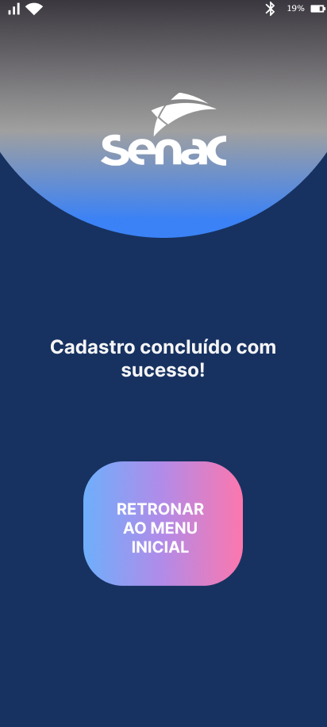
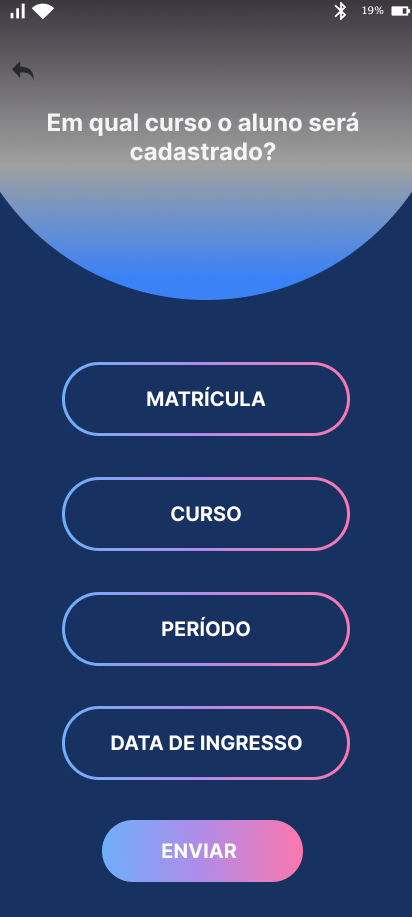
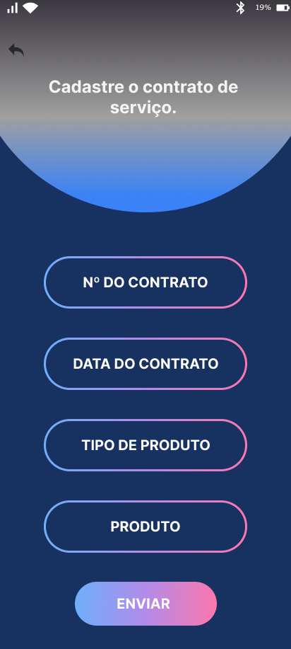
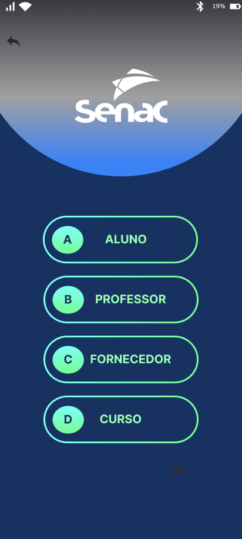
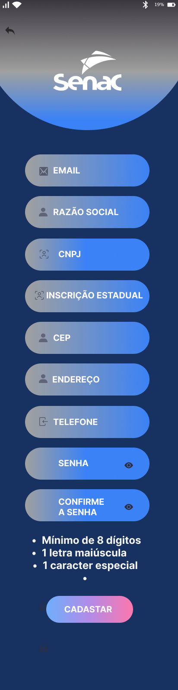
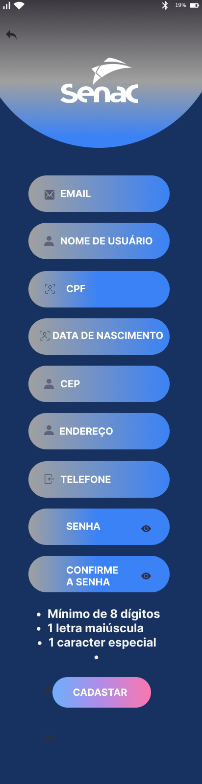

# Projeto Integrador - Sistema de Gestão de Cadastros (SENAC)

## Visão Geral
Este repositório faz parte da **2ª entrega** do Projeto Integrador.  
O objetivo é propor e prototipar um sistema de gestão de cadastros para uma universidade, com suporte a diferentes perfis de usuários.

A 1ª entrega contemplou a **modelagem UML** (casos de uso e classes).  
Nesta 2ª entrega, apresentamos os **protótipos funcionais** desenvolvidos no Figma, de acordo com os requisitos levantados.

---

##  Tecnologias Utilizadas
- Figma (protótipos de interface)  
- GitHub (versionamento e colaboração)  

---

## Funcionalidades do Sistema
O sistema contempla os seguintes cadastros:

- Pessoa Física (PF)  
- Pessoa Jurídica (PJ)  
- Professores  
- Alunos  
- Fornecedores  

---

## Protótipo de Telas

### Exemplos
### Tela Inicial

### Tela Final

- **Cadastro de Aluno**  
  

- **Cadastro de Curso**  
  

- **Cadastro de Contrato**  
  

- **Cadastro Inicial**  
  

- **Cadastro de Professor**  
  

- **Cadastro de Aluno**  
 

- **Tela de Cadastro PJ**  
 

- **Tela de Cadastro Professor**  
 

- **Tela de Busca**  
 

---

## Estrutura do Repositório
