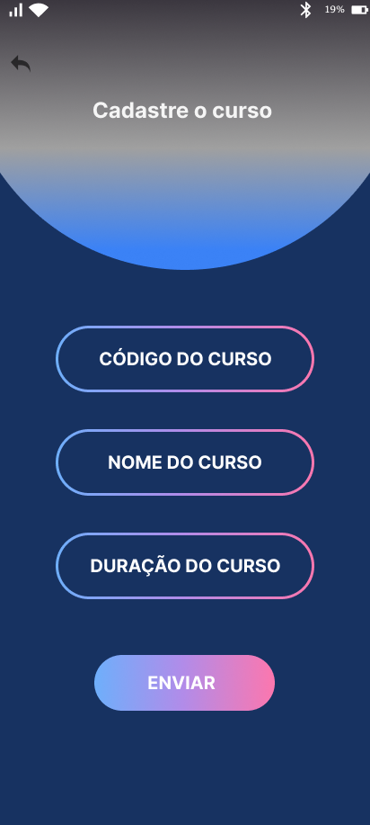

# Projeto Integrador - Sistema de Gestão de Cadastros (SENAC)

## Visão Geral
Este repositório faz parte da **2ª entrega** do Projeto Integrador.  
O objetivo é propor e prototipar um sistema de gestão de cadastros para uma universidade, com suporte a diferentes perfis de usuários.

A 1ª entrega contemplou a **modelagem UML** (casos de uso e classes).  
Nesta 2ª entrega, apresentamos os **protótipos funcionais** desenvolvidos no Figma, de acordo com os requisitos levantados.

---

##  1. Introdução Visão Geral da Proposta
1.1.	Contextualização e motivação
A gestão eficiente de dados é essencial para o funcionamento de uma grande universidade. Este projeto tem como objetivo desenvolver um sistema que simplifique o cadastro e a gestão de diferentes tipos de usuários da universidade SENAC, como alunos, professores, fornecedores e outros. A principal motivação é aumentar a eficiência e a precisão na gestão de dados, empregando técnicas modernas de engenharia de software.
1.2.	Objetivos
- Desenvolver um sistema de gestão de dados utilizando orientação a objetos.
- Criar diagramas UML para modelar o sistema.
- Planejar o desenvolvimento do sistema considerando todo o ciclo de vida do software.

---

##  2. Planejamento para o Desenvolvimento da Solução Proposta

2.1.	Ciclo de Vida do Desenvolvimento
O ciclo de vida escolhido para o desenvolvimento da solução é o modelo incremental, que permite a entrega de partes funcionais do sistema em ciclos curtos. Isso facilita a validação contínua e a adaptação às necessidades dos usuários.

2.2.	Premissas
- O sistema deve ser desenvolvido utilizando uma linguagem de programação orientada a objetos.
- A interface deve ser intuitiva e fácil de usar.
- O sistema deve ser escalável para suportar muitos usuários.

2.3.	Requisitos/História do Usuário
Requisito 1: O sistema deve permitir o cadastro de pessoas físicas.
Requisito 2: O sistema deve permitir o cadastro de pessoas jurídicas.
Requisito 3: O sistema deve permitir o cadastro de professores.
Requisito 4: O sistema deve permitir o cadastro de fornecedores.
Requisito 5: O sistema deve permitir o cadastro de alunos.

2.4.	Planejamento
Etapa 1: Levantamento de Requisitos (1 semana)
Etapa 2: Modelagem UML (2 semanas)
Etapa 3: Desenvolvimento do Protótipo Funcional (3 semanas)
Etapa 4: Validação de Usabilidade (1 semana)
Etapa 5: Implementação Final (4 semanas)

---

##  3.	PROTÓTIPO FUNCIONAL E EXPERIMENTOS DE USABILIDADE

3.1.	Protótipo Funcional
O protótipo funcional será desenvolvido utilizando uma ferramenta de prototipagem, como o Figma ou o Adobe XD. A interface deve ser intuitiva, com menus claros e acessíveis para cada tipo de cadastro.

3.2.	Experimento de Usabilidade
O experimento de usabilidade envolverá testes com usuários reais para avaliar a facilidade de uso e a eficiência da interface. Serão coletados feedbacks para melhorias contínuas.

---

##  4. Diagrama de Classes

4.1. Diagrama de Classes UML

4.2.	Descrição Textual das Classes

Lista das classes principais:
•	Pessoa (classe genérica)
Atributos:
-id: int
- nome: String
- telefone: String
- email: String
- endereco: String
atualizarContato(telefone, email, endereco): void
validarEmail(): boolean
exibirDados(): String

•	Pessoa Física (herda de Pessoa)
- cpf: String
- dataNascimento: Date
- sexo: String
validarCPF(): boolean

•	PessoaJurídica (herda de Pessoa)
- cnpj: String
- razaoSocial: String
- inscricaoEstadual: String
validarCNPJ(): boolean
exibirRazaoSocial(): String

•	Aluno (herda de PessoaFísica)
- matricula: String
- curso: String
- periodo: String
- dataIngresso: Date
  
•	Professor (herda de PessoaFísica)
- matricula: String
- departamento: String
- titulacao: String
adicionarDisciplina(disciplina): void
removerDisciplina(disciplina): void
atualizarDepartamento(departamento): void

•	Fornecedor (herda de PessoaJurídica)
- tipoProduto: String
- contratoVigente: Boolean
renovarContrato(): void
encerrarContrato(): void
fornecerProduto(produto, quantidade): void
verificarContratoVigente(): boolean

•	Curso
- codigoDoCurso: String
-nomeDoCurso: String
-duracao: Int
calcularDuracaoEmMeses(): Int

---

##  5. Tecnologias Utilizadas
- Figma (protótipos de interface)  
- GitHub (versionamento e colaboração)  

---

## 6. Funcionalidades do Sistema
O sistema contempla os seguintes cadastros:

- Pessoa Física (PF)  
- Pessoa Jurídica (PJ)  
- Professores  
- Alunos  
- Fornecedores  

---

## 7. Protótipo de Telas

### Exemplos
### Tela Inicial

### Tela Final

- **Cadastro de Aluno**  
  

- **Cadastro de Curso**  
  

- **Cadastro de Contrato**  
  

- **Cadastro Inicial**  
  

- **Cadastro de Professor**  
  

- **Cadastro de Aluno**  
 

- **Tela de Cadastro PJ**  
 

- **Tela de Cadastro Professor**  
 

- **Tela de Busca**  
 

---

## Estrutura do Repositório
